# DESIGN AND IMPLEMENTATION OF PULSEVAULT

## Quick-Read Thesis Companion (Synced to current `PurdueThesis` chapters)

**Author:** Priyam More  
**Degree:** Master of Science in Computer Science  
**Institution:** Purdue University Fort Wayne  
**Year:** 2026  
**Citation style:** APA 7th edition (author-date)

---

## 1-Minute Read

This thesis argues that institutions need a **secure, operable, reproducible video pipeline** for procedural knowledge, and that this can be defended as a systems artifact through:

1. **Architecture rationale** (decision, alternatives, criteria, trade-off).
2. **Implementation traceability** (direct mapping to routes/workers/libs).
3. **Bounded technical validation** (correctness checks without overclaiming adoption outcomes).

The core architecture decisions are:

- Resumable ingest + explicit finalize boundary.
- Queue-mediated async transcoding.
- HLS + short-lived signed token access.
- Gateway trust-zone enforcement.
- Crash-consistent disk-first metadata.
- Tamper-evident audit chain logging.
- Segment-based mobile draft workflow.

---

## Abstract (Quick)

Institutions lose procedural knowledge when expertise remains tacit or fragmented. Pulse/PulseVault is presented as a **design-rationale systems artifact**: a mobile capture client plus secure backend pipeline for ingesting, processing, and delivering short-form institutional video.

The contribution is not product novelty alone; it is the explicit rationale chain grounded in standards/literature, traceability to implementation, and bounded validation checks. Claims are intentionally limited to architecture coherence and technical plausibility. Large-scale user outcomes are deferred.

---

## CHAPTER 1. INTRODUCTION (Quick)

### Problem

How should institutions design and justify a secure short-form procedural video system when full human-subject evaluation is out of current scope?

### Research Objectives

1. Design coherent end-to-end architecture.
2. Provide explicit rationale with alternatives/trade-offs.
3. Demonstrate implementation traceability.
4. Provide bounded technical validation.

### Research Questions

- **RQ1:** Best architecture pattern under institutional constraints?
- **RQ2:** How to justify decisions with explicit trade-offs?
- **RQ3:** How to map rationale to code-level implementation?
- **RQ4:** What bounded checks are enough for plausibility?

### Scope Boundary

In scope: architecture + traceability + bounded technical checks.  
Out of scope: adoption impact, universal video superiority claims, generalized ROI.

---

## CHAPTER 2. LITERATURE REVIEW (Decision-Relevant)

| Theme                     | Anchor                               | Design Impact                                   |
| ------------------------- | ------------------------------------ | ----------------------------------------------- |
| Knowledge externalization | Nonaka; Davenport & Prusak           | Treat capture as infrastructure, not formatting |
| Multimedia cognition      | Mayer                                | Support short/segmented procedural media        |
| Mobile heterogeneity      | Mobile CSCW constraints              | Keep edge capture simple; normalize server-side |
| Resumable ingest          | tus protocol                         | Reliability under unstable networks             |
| Adaptive delivery         | RFC 8216 (HLS)                       | Interoperable adaptive playback                 |
| Auth/security             | RFC 6749 + RFC 9700                  | Scoped token and hardened access posture        |
| Regulated framing         | NIST SP 800-66r2; HHS HIPAA guidance | Compliance-aligned control language             |
| Reliability/observability | Google SRE; Prometheus docs          | Telemetry as first-class architecture           |

---

## CHAPTER 3. METHODOLOGY (Quick)

### 3-Layer Method

1. Design-rationale records.
2. Implementation traceability.
3. Bounded technical validation.

### Scope Control Rule

A claim is allowed only if it is:

- grounded in standards/high-confidence literature, and/or
- traceable to concrete implementation evidence.

### Validation Domains

- Upload/finalize correctness.
- Transcode lifecycle correctness.
- Token/path access control correctness.
- Observability pathway availability.

| Validation Domain | Check Type                   | Evidence Source                             | Scope    |
| ----------------- | ---------------------------- | ------------------------------------------- | -------- |
| Upload/finalize   | State transition correctness | Backend routes + sidecar writes             | In scope |
| Transcode         | Queue-worker lifecycle       | Worker + Redis logic                        | In scope |
| Access control    | Token/path safety            | Media route + gateway policy                | In scope |
| Observability     | Metrics/log availability     | Prometheus/Loki/Grafana configs + endpoints | In scope |
| Human outcomes    | Adoption/usability impact    | Not finalized                               | Deferred |

---

## CHAPTER 4. SYSTEM DESIGN + MINIMAL TECHNICAL VALIDATION

### 4.1 End-to-End Architecture (Concise)

**Subsystems:** mobile app, Fastify backend, Redis queue, transcode worker (FFmpeg/ffprobe), Nginx gateway, authenticated frontend, observability stack, filesystem + metadata sidecars.

**Flow:** capture/upload -> resumable ingest -> explicit finalize -> async transcode -> tokenized playback -> monitored operation.

---

### 4.2 Decision A: Resumable Ingest + Explicit Finalize

| Element      | Detail                                                |
| ------------ | ----------------------------------------------------- |
| Decision     | Resumable ingest + separate finalize endpoint         |
| Alternatives | Single-shot upload; implicit finalize                 |
| Criteria     | Reliability, recoverability, explicit commit boundary |
| Trade-off    | Added control-plane complexity                        |

**Implementation evidence:** `pulse-vault/pulsevault/routes/uploads.js`, `/uploads/finalize` logic.

---

### 4.3 Decision B: Async Queue-Based Transcoding

| Element      | Detail                                              |
| ------------ | --------------------------------------------------- |
| Decision     | Worker-based queue-mediated transcode               |
| Alternatives | Sync transcode in API path                          |
| Criteria     | API responsiveness, scaling, operational separation |
| Trade-off    | Eventual consistency delay                          |

**Implementation evidence:** `pulse-vault/pulsevault/plugins/redis.js`, `pulse-vault/pulsevault/workers/transcode-worker.js`.

---

### 4.4 Decision C: Adaptive HLS + Tokenized Access

| Element      | Detail                                       |
| ------------ | -------------------------------------------- |
| Decision     | HLS with short-lived signed URLs             |
| Alternatives | Public static media links; long-lived URLs   |
| Criteria     | Bounded capability access + interoperability |
| Trade-off    | Token issuance/validation overhead           |

**Implementation evidence:** `pulse-vault/pulsevault/routes/media.js`.

---

### 4.5 Decision D: Gateway Trust-Zone Policy

| Surface             | Control                              | Intended Effect        |
| ------------------- | ------------------------------------ | ---------------------- |
| `/uploads`          | Gateway forward + backend validation | Controlled ingest path |
| `/media/sign`       | Restricted policy                    | Limit signing exposure |
| `/media/videos/...` | Token + path checks                  | Bounded retrieval      |

**Implementation evidence:** `pulse-vault/nginx/conf.d/pulsevault-locations.conf`.

---

### 4.6 Decision E/F/G (Storage, Audit, Mobile Drafts)

- **E (Metadata durability):** temp write -> fsync -> atomic rename -> fsync parent dir.  
  Evidence: `pulse-vault/pulsevault/lib/metadata-writer.js`.
- **F (Tamper-evident audit):** hash-chained append-only entries with verification routine.  
  Evidence: `pulse-vault/pulsevault/lib/audit-logger.js`.
- **G (Mobile segment workflow):** non-destructive segment capture/edit, draft persistence, resumable upload/finalize.  
  Evidence: `app/(camera)/shorts.tsx`, `utils/draftStorage.ts`, `utils/tusUpload.ts`.

---

## Visual Walkthrough (Images)

### Mobile App

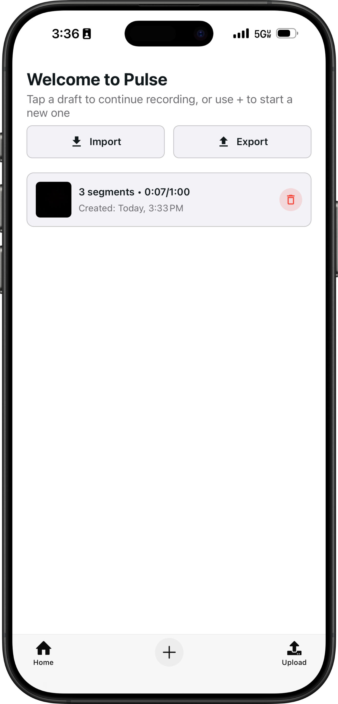
_Home screen: persisted drafts and quick actions preserve workflow continuity._

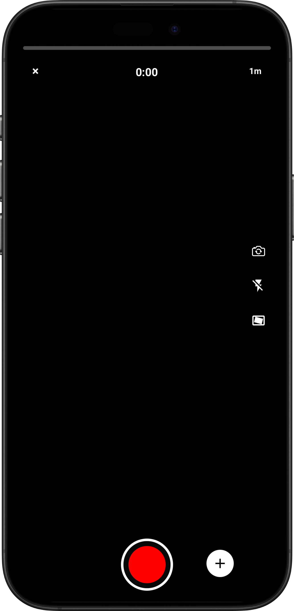
_Capture idle baseline before active recording._

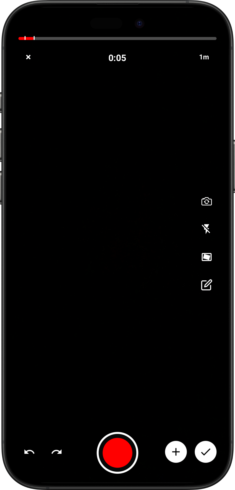
_Active recording controls for segmented authoring._

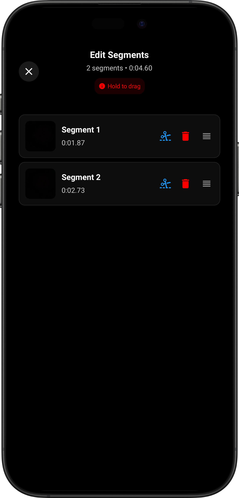
_Segment editing view with ordered non-destructive controls._

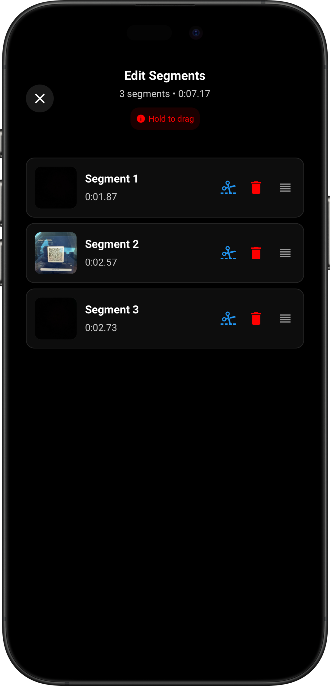
_Extended segment list/edit state in the draft workflow._

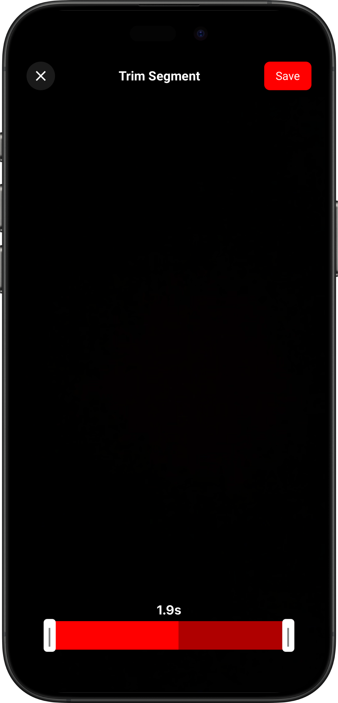
_Trim boundary adjustment before merge/export._

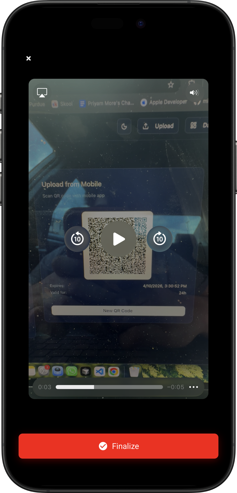
_Preview/finalize boundary before commit/upload._

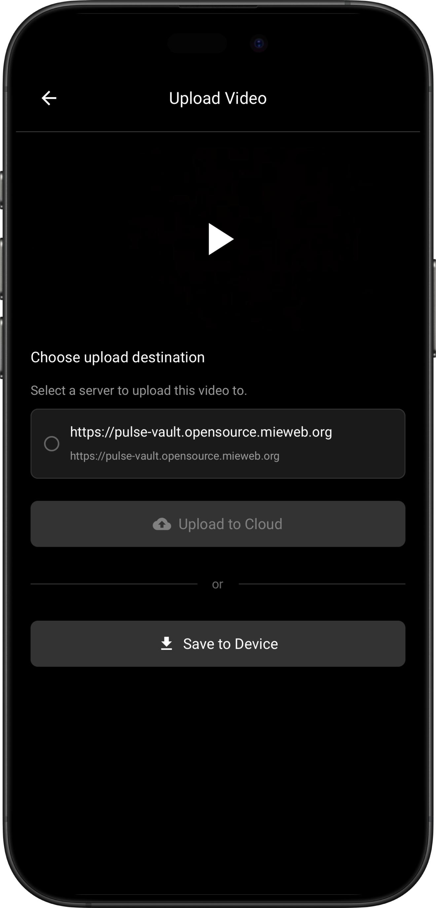
_Upload flow before vault destination binding._

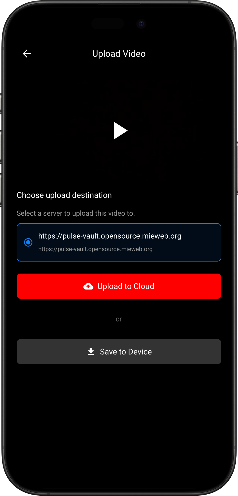
_Destination selected; upload action enabled._

### PulseVault Web

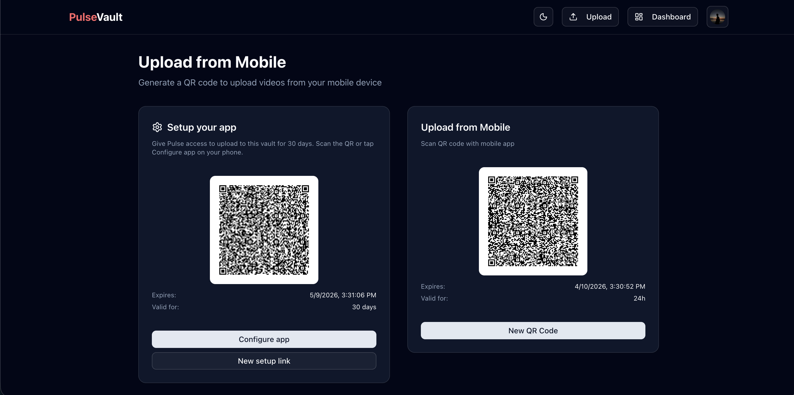
_QR setup binds mobile ingest sessions to vault context._

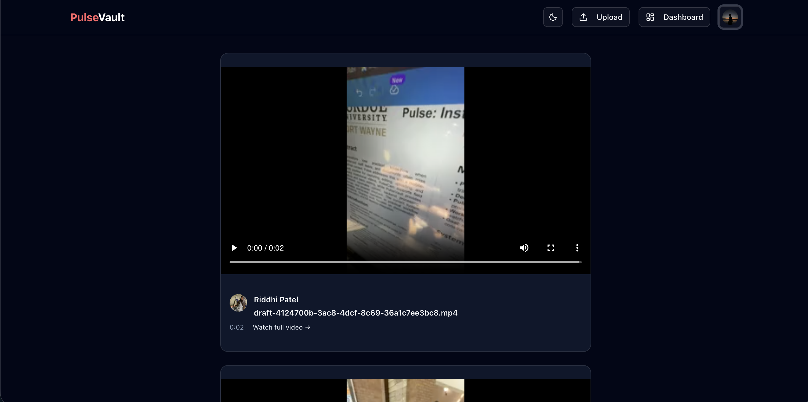
_Authenticated feed and playback context._

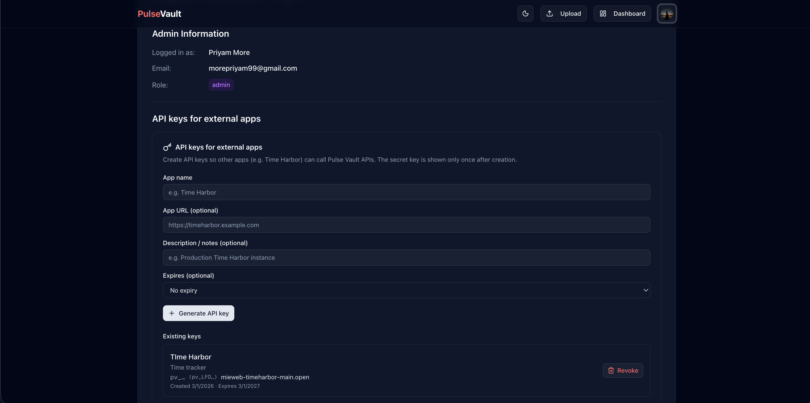
_API key lifecycle controls for external integrations._

---

## Bounded Validation Snapshot (Chapter 4.10)

### Upload/Finalize

| Check                   | Expected                    | Observed | Notes |
| ----------------------- | --------------------------- | -------- | ----- |
| Upload session creation | Session ID issued           | [fill]   |       |
| Chunk patch acceptance  | Offset advances             | [fill]   |       |
| Finalize transition     | Uploaded metadata committed | [fill]   |       |

### Transcode Lifecycle

| Check             | Expected                       | Observed | Notes |
| ----------------- | ------------------------------ | -------- | ----- |
| Queue dequeue     | Job consumed by worker         | [fill]   |       |
| Rendition outputs | Playlists + segments generated | [fill]   |       |
| Metadata update   | Transcoded fields written      | [fill]   |       |

### Token/Access Control

| Check                 | Expected | Observed | Notes |
| --------------------- | -------- | -------- | ----- |
| Expired token request | Denied   | [fill]   |       |
| Tampered signature    | Denied   | [fill]   |       |
| Valid token path      | Served   | [fill]   |       |

### Observability Availability

| Check               | Expected                        | Observed | Notes |
| ------------------- | ------------------------------- | -------- | ----- |
| `/metrics` exposure | Scrape-ready endpoint           | [fill]   |       |
| Log emission        | Access/upload/transcode entries | [fill]   |       |
| Dashboard pipeline  | Metric/log ingestion available  | [fill]   |       |

---

## CHAPTER 5. DISCUSSION AND IMPLICATIONS (Quick)

### Objective-Level Takeaways

- Architecture coherence achieved through explicit subsystem boundaries.
- Rationale quality improved by alternatives + trade-off documentation.
- Traceability achieved but requires maintenance to avoid drift.
- Validation is intentionally bounded; not equivalent to broad outcome proof.

### Threats to Validity

- Single deployment profile/codebase.
- Limited benchmark depth.
- No finalized human-subject evidence in core claims.

### Practical Implications

- Suitable blueprint for secure institutional procedural media workflows.
- Finalize boundaries and tokenized delivery are governance control points.
- Observability should be deployment-critical from day one.

---

## CHAPTER 6. CONCLUSION AND FUTURE WORK (Quick)

### Main Contributions

1. Standards-grounded architecture rationale.
2. Implementation traceability across ingest/process/delivery/observability.
3. Bounded validation protocol aligned to current scope.

### Limitations

- No broad adoption study.
- No formal red-team/security proof.
- Limited quantitative benchmarking.

### Future Work

1. Throughput and failure benchmarking campaigns.
2. Optional IRB-approved usability/adoption studies.
3. Multi-tenant governance and deeper compliance artifacts.
4. Advanced retrieval/editing (e.g., semantic indexing, AI-assisted workflows).

---

## Proven vs Deferred (At a Glance)

| Claim Category                     | Status                | Basis                                  |
| ---------------------------------- | --------------------- | -------------------------------------- |
| Architecture coherence + rationale | Established           | Decision records + standards alignment |
| Implementation traceability        | Established           | Route/worker/library evidence mapping  |
| Technical correctness pathways     | Established (bounded) | Scenario validation checks             |
| User adoption impact               | Deferred              | Needs empirical studies                |
| Large-scale performance envelope   | Deferred              | Needs benchmark campaigns              |

---

## Working Reference Set (Condensed)

- Bass, Clements, and Kazman (2012), _Software Architecture in Practice_.
- Davenport and Prusak (1998), _Working Knowledge_.
- Hevner et al. (2004), design science in information systems.
- Nonaka (1994), organizational knowledge creation.
- Mayer (2005, 2009), multimedia learning.
- RFC 6749 (OAuth 2.0), RFC 9700 (OAuth 2.0 security BCP), RFC 8216 (HLS).
- tus protocol 1.0.0.
- NIST SP 800-66r2; HHS HIPAA Security Rule summary.
- Google SRE (2016); Prometheus docs.
